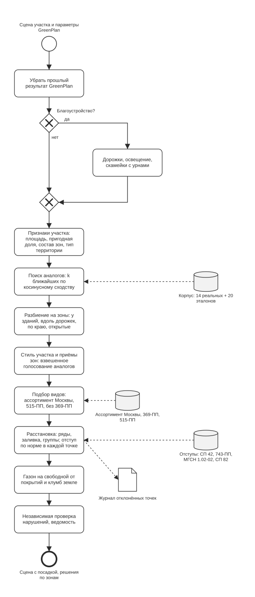

# Алгоритм GreenPlan

GreenPlan проектирует озеленение участка по аналогии с реализованными проектами на похожих участках. Он не придумывает решение с нуля и не обучает модель. Решения принимаются правилами и геометрией, поэтому их можно воспроизвести и проверить. Языковая модель не выбирает приёмы и не считает координаты. Она только пересказывает готовые решения связным текстом для записки, и этот шаг необязателен.

Вход: сцена участка, полученная разбором DXF или пачки DWG (граница, зоны ограничений, здания, существующие объекты), и параметры пользователя. Выход: сцена с новыми посадками, газоном и благоустройством, решения по каждой зоне с их происхождением, список нарушений, ведомость, журнал отклонённых точек.

Точка входа: `POST /api/greenplan/generate`, код в `backend/greenplan/pipeline.py`. Время работы — секунды, от 2 до 10 на обычном участке.

*Схема в нотации BPMN, подпроцесс «GreenPlan» из [общего процесса](bpmn/greencity_process.svg). Исходник: [bpmn/greencity_process.bpmn](bpmn/greencity_process.bpmn).*

## Шаги

| № | Шаг | Модуль | Что получается |
|---|---|---|---|
| 0 | Подготовка | `pipeline.py` | сцена без прошлого результата GreenPlan |
| 1 | Благоустройство (по параметрам) | `improvements.py` | дорожки, фонари, скамейки с урнами |
| 2 | Признаки участка | `site_characterization.py` | вектор признаков, тип территории |
| 3 | Поиск аналогов | `pattern_retrieval.py`, `pattern_corpus.py` | k самых похожих проектов корпуса |
| 4 | Разбиение на зоны | `zone_partitioning.py` | геометрические зоны четырёх видов |
| 5 | Стиль участка и приёмы зон | `pattern_assignment.py`, `pattern_library.py` | стиль, ведущий аналог, приём каждой зоны |
| 6 | Подбор видов | `species_selection.py` | палитра видов участка и основание подбора |
| 7 | Расстановка | `deterministic_placement.py`, `core/placement.py` | новые деревья и кустарники, журнал отклонений |
| 8 | Газон | `lawn.py` | газон площадью: новый и сохраняемый |
| 9 | Проверка и ведомость | `violation_report.py`, `assortment_report.py` | нарушения, ведомость по видам |
| 10 | Текст и документы | `decision_report.py`, `document.py`, `explanations.py` | текст-обоснование, записка DOCX, файл объяснений |

### 0. Подготовка

Повторный запуск должен заменять прошлый результат, а не добавлять второй слой посадок. Поэтому из сцены убираются объекты и зоны с пометкой `source: "greenplan"` и газон GreenPlan. Существующие объекты и правки пользователя остаются.

### 1. Благоустройство

Шаг выполняется только если пользователь включил его в параметрах. Благоустройство строится раньше посадок, чтобы посадки соблюдали отступы от него.

- **Дорожки.** Во дворах участка, не больше трёх (`MAX_YARDS`), строится каркас: от подъезда к подъезду и к парковке, если она рядом. Каркас — тот же, что у операции «дизайн двора» ИИ-ассистента (`text_editor/courtyard_layout.py`): минимальное остовное дерево между точками, вынесенными от подъездов вглубь двора. Дорожка становится зоной `pedestrian_path` шириной 1,5 м. От неё отсчитываются отступы посадок (для дерева 0,7 м), её обходит газон, вдоль неё появляются полосы под изгородь. В DXF она попадает на слой `NEW_PATHS`.
- **Освещение.** Фонари ставятся через 20 м зигзагом вдоль новых дорожек и снаружи вдоль существующих. Опоры не ставятся в охранные зоны сетей: фонарь ищет место на другой стороне дорожки или со сдвигом до 8 м. Что не удалось поставить, записывается в `notes`.
- **Скамейки с урнами** ставятся через 30 м вдоль новых дорожек.

### 2. Признаки участка

`characterize_site(scene)` считает:

- площадь участка;
- пригодную под озеленение площадь: разрешённые зоны (или весь участок) минус запретные и предупреждающие зоны с отступом для дерева;
- долю пригодной площади (`plantable_ratio`);
- число зданий;
- доли площади по типам зон ограничений: здания, дороги, дорожки, газопровод, канализация, водопровод, электросети, детские площадки;
- вытянутость границы: отношение сторон описанного прямоугольника;
- тип территории.

Тип территории определяется правилами — категориями из ассортимента озеленения Москвы, которые различимы по геометрии. Правила проверяются по порядку, срабатывает первое:

| Тип | Правило |
|---|---|
| двор | есть детская площадка и хотя бы одно здание |
| промышленная, охранная | без зданий, охранные зоны сетей занимают не меньше 40 % площади |
| улица | есть проезжая часть, стороны границы 3:1 и больше |
| парк, сквер | без зданий, не меньше 2000 м², пригодная доля не меньше 0,7 |
| площадь | без зданий, не меньше 2000 м², компактная (стороны меньше 3:1), пригодная доля не больше 0,35 |
| не определён | ни одно правило не сработало |

На участках меньше 2000 м² формы и доли слишком шумные, поэтому парк и площадь на них не определяются.

### 3. Поиск аналогов

**Корпус.** В корпусе 34 проекта (`locations/`, решения — `data/pattern_corpus.yaml`):

- **14 реальных проектов** из набора кейса. У каждого есть DXF и `design_rationale.md` — выдержка из пояснительной записки о том, какой приём применён и почему.
- **20 синтетических эталонов** (`21_…_primer` – `40_…_primer`). Это типовые городские случаи, которых среди реальных проектов нет или мало: шумозащитная полоса, круглая площадь, двор с детской площадкой, бульвар, озеленённая парковка, сквер над сетями, 10 фрагментов улиц с домами. Их собирает генератор `tools/primers/`, и каждая посадка в них проверена по тем же нормам. Каждый эталон помечен как синтетический.

Признаки проектов корпуса посчитаны заранее: `data/pattern_corpus_features.json` хранится вместе с sha256 исходного DXF. Если DXF изменился, признаки пересчитываются.

**Вектор признаков** состоит из:

- `plantable_ratio`;
- `log(1 + площадь)` — логарифм, чтобы разброс площадей не заглушал остальное;
- числа зданий;
- долей восьми известных типов зон;
- one-hot типа территории (только если тип определён, а не «не определён»).

**Сходство.** Каждый признак стандартизуется (z-score) по среднему и стандартному отклонению корпуса. Без этого логарифм площади (порядок 5–12) заглушил бы доли (0–1). Сходство участка с проектом — косинус между стандартизованными векторами. Признак, постоянный по всему корпусу, делится на 1, а не на 0.

Результат — k ближайших проектов (`NeighborMatch(slug, similarity)`), по умолчанию k = 3 (параметр `k` запроса, от 1 до 9).

**Самопроверка:** каждый проект корпуса, поданный как новый участок, находит сам себя со сходством 1,0. Это регрессионный тест поиска.

### 4. Разбиение на зоны

Пригодная площадь делится на геометрические зоны четырёх видов, в порядке приоритета:

| Вид зоны | Что это | Для каких приёмов |
|---|---|---|
| `building_border` | полоса 3 м сразу за нормативным отступом от здания | кольцо у здания, изгородь |
| `path_corridor` | полоса 3 м вдоль дорожек и проезжей части | ряды, аллеи, изгородь |
| `site_edge` | полоса 3 м вдоль границы участка | изгородь по периметру |
| `open_area` | всё остальное | площадные приёмы: рощи, сетки, заливка |

Место, близкое и к дому, и к дорожке, достаётся дому: у нормы отступа от здания больше вес. Каждый несвязный кусок становится отдельной зоной, чтобы приём назначался ему независимо. Многоугольник с дыркой разрезается на куски без дыр, потому что зона хранит один контур.

### 5. Стиль участка и приёмы зон

**Библиотека приёмов** (`pattern_library.py`) — десять параметризуемых приёмов в трёх семействах геометрии:

| Приём | Семейство | Стиль | Виды зон |
|---|---|---|---|
| `linear_hedge_row` — изгородь или ряд вдоль полосы | linear | нейтральный | у здания, вдоль дорожек, по краю |
| `building_ring` — кольцо кустарника вокруг здания | linear | нейтральный | у здания |
| `diagonal_rows` — диагональные ряды | linear | регулярный | открытые, вдоль дорожек |
| `flowing_rows` — волнистые ряды | linear | пейзажный | открытые, вдоль дорожек |
| `formal_bosque_grid` — боскет, ортогональная сетка деревьев | linear | регулярный | открытые |
| `concentric_rings` — концентрические кольца | linear | регулярный | открытые |
| `triangular_grid_fill` — треугольная сетка | area_fill | регулярный | открытые |
| `grove_clusters` — рощи | clustered | пейзажный | открытые |
| `poisson_scatter_fill` — свободный разброс | area_fill | пейзажный | открытые |
| `generic_fill` — заливка без замысла | area_fill | нейтральный | любые |

Решение принимается на двух уровнях, чтобы у участка был единый стиль. Если выбирать приём для каждой зоны отдельно, в одном дворе оказываются волны рядом с диагоналями.

**Уровень 1 — стиль участка.** Голосуют k самых похожих проектов (сходство не ниже `MIN_VOTE_SIMILARITY = 0.2`), у которых для видов зон этого участка есть решение регулярного или пейзажного стиля. Проект только с нейтральными решениями место избирателя не занимает. Голос весит столько, сколько сходство. Побеждает стиль с наибольшей суммой весов. Ведущий аналог — самый похожий проект победившего стиля. Если пользователь задал стиль в параметрах, голосования нет. Тогда ведущий аналог — самый похожий проект этого стиля.

**Уровень 2 — приёмы зон.** Для каждого вида зоны голосуют k самых похожих проектов с решением для этого вида в стиле участка или нейтральным. Голосуют только проекты со сходством не ниже порога. Заливка без замысла голосует, только если других решений нет. Зоны одного вида делятся между приёмами по площади, пропорционально весу голосов: крупнейшая зона достаётся самому весомому приёму, каждая следующая — приёму, который сильнее всех недобрал свою долю.

**Происхождение решения** записывается в `ZoneAssignment`:

- `source_project` — самый похожий проект среди голосовавших за приём зоны;
- `confidence` — доля избирателей, голосовавших за этот приём;
- `site_style`, `lead_project` — общее решение участка.

**Нет аналогов.** Если избирателей нет, зона получает типовой приём стиля: для открытых зон регулярного участка — треугольную сетку, пейзажного — рощи, для полос — изгородь или кольцо у здания. Такое решение идёт с `confidence = 0` и `source_project = None`. В записке и на панели оно помечено «типовое решение — проверить».

Порог 0,2 подобран на корпусе: доля площади зон на типовом приёме — 5,6 %, и ни один тестовый участок не остаётся без аналогов совсем.

### 6. Подбор видов

Для каждой пары (вид зоны, приём) подбираются виды деревьев и кустарников — один набор на весь участок. Например, изгородь вдоль всех дорожек делается из одного вида.

**Фильтры по нормативным документам:**

1. Вид есть в ассортименте для озеленения Москвы (`data/norms/assortment-msk`) и отмечен «+» для типа территории участка. Тип «не определён» считается дворовой территорией.
2. Вида нет в перечне инвазивных растений ППМ 369-ПП. Каталог их и так не содержит, здесь проверка повторная.
3. Коды ограничений ассортимента:
   - код 2 (не высаживать вблизи детских площадок) — такой вид не сажается на участке с детской площадкой;
   - код 5 (чувствителен к реагентам и выхлопам) — не в полосы вдоль дорожек и проездов;
   - код 7 — самосев; такие виды не сажаются, потому что границ особо охраняемых территорий в DXF нет.
4. Колючие виды — не вдоль дорожек (СП 82.13330.2016, п. 9.22).
5. Породы с широкой кроной — не в полосу у здания: им нужно 10 м от стены (ППМ 743-ПП, прим. 3 к табл. 3.6.1).

**Роль и форма.** У каждого приёма есть роль для деревьев и для кустарников: группы морфологических форм и число видов. Аллея, изгородь и боскет делаются из одного вида, роща и свободная посадка — из смеси разных родов. Форма берётся по морфологическому архетипу вида (`data/plant_archetypes/species_catalog.json`).

**Порядок выбора:**

1. Базовый ассортимент ППМ 515-ПП (для дворов).
2. Классы ассортимента: основной, затем дополнительный, затем перспективный.
3. Стабильный хеш участка: разные участки получают разные виды, один и тот же участок — всегда одни и те же.

**Единая палитра участка.** Пары (вид зоны, приём) обрабатываются по убыванию площади. Крупнейшие задают палитру, следующие берут из неё виды подходящей формы и добавляют новые, только пока в палитре меньше четырёх видов деревьев и четырёх видов кустарников. Предел мягкий: роль, которой по форме не подходит ни один вид палитры, всё равно получает свой вид.

Предпочтительные виды пользователя ставятся первыми в любой роли своей категории, без ограничения по форме. Нормы для них действуют как для всех. Почему вид не использован, пишется в `notes`.

Если ни один вид каталога не прошёл фильтры (например, в тестах с синтетическим каталогом), каталог берётся как есть, и основание помечено «вне ассортимента».

### 7. Расстановка

Приём и зона превращаются в точки посадки одним алгоритмом на семейство, а не отдельным кодом на каждый приём:

- **linear** — точки с шагом вдоль линии:
  - формы линии: прямая по длинной оси зоны, синусоида, диагональ, контур зоны (кольцо у здания), вложенные кольца;
  - на широкой открытой зоне — столько параллельных рядов с шагом 6 м, сколько помещается, но не больше 10;
  - шаг кустов 1,4 м, деревья в 8,5 раза реже, если приём не задал свой шаг (у боскета шаг квадратной сетки);
  - деревья сажаются раньше кустов, иначе кусты заняли бы всю линию.
- **area_fill** — кандидаты по решётке на всей площади зоны и равномерный отбор (k-средних, `pick_spread`):
  - шаг кустов 6 м, деревьев — вдвое больше;
  - треугольная сетка берёт точки прямо с решётки: ей нужен видимый регулярный узор.
- **clustered** — центры групп через 8 м, одна группа на 200 м², у каждого центра — плотная группа одного вида с шагом 2 м.

**Проверка нормы в каждой точке.** Точка проверяется во время расстановки, а не фильтром после. Планировщик `Placer` (`core/placement.py`) проверяет по каждой точке:

- внутри участка, не ближе 0,5 м к его границе;
- вне запретных и предупреждающих зон, расширенных на нормативный отступ с учётом породы (`core/setback_norms.py`, таблица ниже);
- не ближе 1 м к другим объектам; для пар с нормой — не ближе нормы (дерево — 4 м от опоры освещения, СП 42 табл. 9.1).

Кандидаты заранее очищаются от мест, занятых существующими объектами. Иначе на участке с сотнями старых деревьев центр рощи почти всегда попадал к старому дереву, и группа не вставала.

**Журнал отклонений.** Каждая точка, отклонённая по норме (сеть, здание, порода у здания или теплосети, опора освещения, колючие у дорожек), записывается в журнал (`RejectionLog`) с правилом и пунктом НПА. Подробно записываются первые 300 на участок, остальные только считаются. Отказы по зазору между соседними объектами — правило планировщика, а не норма, поэтому они только считаются.

**Пределы объёма:**

- не больше 400 деревьев и 400 кустов на зону; у рядов предел достигается увеличением шага, чтобы ряды оставались по всей зоне;
- не больше 60 групп на зону;
- не больше 10 000 новых посадок на участок; сверх этого — равномерное прореживание с сохранением доли каждой зоны.

**Вид в 3D.** Деревья получают размер с разбросом (15 % в свободных посадках, 6 % в регулярных) и случайный поворот. Разброс детерминированный: сид — id и место объекта. Высота модели подгоняется под реальную высоту вида из каталога.

### 8. Газон

В проектах газон считают площадью: в ведомости по форме 9 ГОСТ 21.508 это м². Поэтому газон строится многоугольниками после посадок:

- **где:** разрешённые зоны (слои газона и вычисленная парсером открытая земля; если их нет — весь участок) минус твёрдые покрытия и сооружения, минус клумбы кустарника (круг кроны, соседние кусты ряда сливаются);
- **над сетями — можно:** таблица 9.1 СП 42.13330 и таблица 3.6.1 ППМ 743-ПП нормируют расстояния только для деревьев и кустарников;
- **очистка:** полосы уже 0,5 м и куски меньше 5 м² отбрасываются, контур упрощается с точностью 0,25 м;
- **статус:** газон на существующем газоне исходного плана — `existing` (сохраняется), остальной — `new` (устройство). В ведомость и DXF (слой `NEW_LAWN`) идёт только новый;
- **вид:** «Газон обыкновенный», посев из устойчивой травосмеси (ППМ 515-ПП, табл. 4).

### 9. Проверка нарушений и ведомость

`find_violations` заново проверяет **все** объекты сцены, и существующие, и новые, против всех зон ограничений. Код расстановки для этого не используется. Для новых посадок это независимое подтверждение, что нарушений нет, а нарушения существующих объектов не скрываются. Кандидаты отбираются через STRtree по зонам, расширенным на худший отступ, а точное расстояние считается по исходной геометрии.

Ведомость (`assortment_report.py`) — количество новых деревьев и кустарников по видам (шт.), газон (м²) и отдельно благоустройство.

### 10. Текст и документы

- **Текст-обоснование** (`POST /api/greenplan/report`, `decision_report.py`). Решения зон сводятся по (вид зоны, приём, аналог), и YandexGPT 5.1 Pro пересказывает сводку связным текстом. Модели запрещено добавлять виды, площади и проекты, которых нет в сводке. Без ключа или при недоступной модели ответ 200 с `report_error`; расстановка от этого не зависит.
- **Пояснительная записка** (`POST /api/greenplan/document`, DOCX). Её разделы:
  - сведения об участке;
  - нормативная база и применённые отступы;
  - решения с происхождением («по аналогии с проектом X» или «типовое решение — проверить»);
  - ведомость по форме 9 ГОСТ 21.508-2020;
  - проверка норм;
  - технические требования по СП 82.13330.2016;
  - ограничения и допущения.

  Текст ИИ идёт только приложением с пометкой «проверить».
- **Файл объяснений** (`POST /api/greenplan/explanations`, JSON или CSV). Описан в [документации решения](SOLUTION.md#4-интерпретируемость-объяснение-каждой-посадки).

## Нормативные отступы

`core/setback_norms.py`, СП 42.13330.2016 п. 9.6 табл. 9.1 и совпадающая с ней табл. 3.6.1 ППМ 743-ПП. Расстояние считается от оси растения до края зоны.

| Ограничение | Дерево | Кустарник |
|---|---|---|
| Здание | 5,0 м | 1,5 м |
| Проезжая часть | 2,0 м | 1,0 м |
| Пешеходная дорожка | 0,7 м | 0,5 м |
| Электрокабель, кабель связи | 2,0 м | 0,7 м |
| Теплосеть | 2,0 м | 1,0 м |
| Газопровод, канализация | 1,5 м | не нормируется |
| Водопровод | 2,0 м | не нормируется |
| Опора освещения | 4,0 м | не нормируется |

Правила по породе только ужесточают таблицу:

- липа, клён, дуб, каштан, тополь — 10 м от здания (ППМ 743-ПП, прим. 3 к табл. 3.6.1);
- колючие кустарники — 2 м от дорожек и детских площадок (СП 82.13330.2016, п. 9.22);
- породы, чувствительные к прогреву, — 2–4 м от теплосети (МГСН 1.02-02, п. 4.2.8);
- экспертные оценки — отдельно, с пометкой «экспертная оценка, не норма акта».

У зон без табличного значения (трансформатор, парковка, площадка, ЛЭП) используется ширина охранной зоны из разметки.

## Свойства алгоритма

- **Детерминированность.** Одна и та же сцена с теми же параметрами даёт тот же результат: случайность только от сидов, привязанных к участку и месту.
- **Прослеживаемость.** У каждой посадки известны:
  - зона и приём;
  - проект-аналог и стиль;
  - основание подбора вида;
  - ближайшие ограничения с нормой и пунктом НПА;
  - id, общий для сцены, DXF (XDATA) и файла объяснений.
- **Без обучения.** При корпусе в десятки проектов обучение не на чем проверить, поэтому решение переиспользует то, что архитекторы уже сделали на похожих участках. Добавить проект в корпус — значит положить DXF с описанием решений и запустить `make corpus-features`.
- **Честность.** Нарушения не скрываются. Типовые решения без аналогов помечены. Невыполненные параметры попадают в `notes`. Отклонённые по норме точки попадают в журнал.

## Ограничения

- Корпус маленький. Реальные проекты описаны частично, в основном одним-двумя видами зон, поэтому часть решений берётся у синтетических эталонов.
- Реальные участки сами входят в корпус. Для участка из набора кейса ближайшим аналогом может оказаться он сам.
- Решения по существующим деревьям (сохранить, пересадить, вырубить) и компенсационный расчёт не делаются: в данных кейса нет перечётных ведомостей для этого.
- Ширина полос у зданий, дорожек и края (3 м) и шаги посадки подобраны по реальным проектам, а не взяты из норм.

Подробнее — в разделе [«Ограничения, допущения, известные ошибки»](SOLUTION.md#7-ограничения-допущения-известные-ошибки) документации решения.
