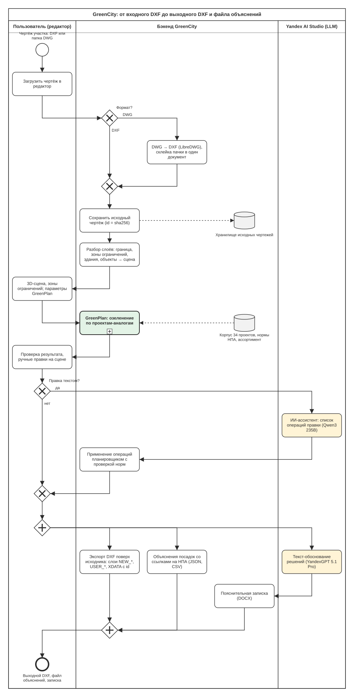

# GreenCity — документация решения

Сервис автоматического проектирования озеленения городских участков с учётом подземных коммуникаций и городской среды. Кейс хакатона «Лидеры цифровой трансформации 2026».

Команда «Вороны»: Артемий Корнилов, Константин Жадько.

| Документ | Что в нём |
|---|---|
| этот документ | назначение и границы MVP, схема процесса, интерпретируемость, методы и библиотеки, проверка результата, ограничения, примеры |
| [GREENPLAN_ALGORITHM.md](GREENPLAN_ALGORITHM.md) | алгоритм GreenPlan по шагам |
| [TECHNICAL_OVERVIEW.md](TECHNICAL_OVERVIEW.md) | техническое устройство: модули, API, парсер, ИИ-ассистент, экспорт, тесты |
| [../README.md](../README.md) | запуск в Docker и локально, тесты, линтеры |
| [CASE_BRIEF.md](CASE_BRIEF.md) | описание кейса |

## 1. Назначение и границы MVP

**Назначение.** Проектировщик загружает чертёж участка (DXF или папку DWG) и получает:

- план озеленения, который соблюдает нормативные отступы от зданий, дорог и подземных сетей;
- выходной DXF, в котором исходные слои не тронуты, а результат лежит на отдельных слоях;
- машиночитаемый файл объяснений со ссылкой на нормативный акт и пункт для каждой посадки;
- пояснительную записку с ведомостью элементов озеленения.

План можно поправить вручную на 3D-сцене или текстом через ИИ-ассистента.

**Что входит в MVP:**

| Возможность | Где |
|---|---|
| Импорт DXF и папки DWG (конвертация LibreDWG), распознавание слоёв: граница, здания, сети с охранными зонами, дороги, дорожки, площадки, существующие деревья и МАФ | `parser/`, `backend/exchange/` |
| 3D-сцена с зонами ограничений и кольцами нормативных отступов, перетаскивание объектов с проверкой норм в реальном времени | `frontend/` |
| GreenPlan — озеленение по проектам-аналогам: стиль участка, приёмы зон, виды из ассортимента Москвы, расстановка с проверкой нормы в каждой точке, газон, благоустройство | `backend/greenplan/`, [алгоритм](GREENPLAN_ALGORITHM.md) |
| Правка текстом: ИИ-ассистент возвращает операции, координаты считает планировщик | `backend/text_editor/` |
| Экспорт DXF поверх исходного чертежа: слои `NEW_*` и `USER_*`, XDATA с id посадки | `backend/exchange/dxf_overlay.py` |
| Файл объяснений (JSON, CSV) и пояснительная записка (DOCX) | `backend/greenplan/explanations.py`, `document.py` |
| Аккаунты и сохранённые проекты, мониторинг, Docker | `backend/accounts/`, `observability/` |

**Что не входит в MVP:**

- решения по существующим деревьям (сохранить, пересадить, вырубить) и компенсационный расчёт — в данных кейса нет перечётных ведомостей и оценок состояния;
- многолетники, цветники и луковичные в автоматической расстановке — GreenPlan сажает деревья, кустарники и газон; цветник можно поставить вручную или через ассистента;
- рельеф, инсоляция, почвы и дренаж — в DXF кейса этих данных нет;
- рабочая документация: посадочные ямы, приствольные лунки, разбивочные чертежи.

**Пользователь** — проектировщик благоустройства или эксперт, проверяющий проект. Интерфейс — веб-приложение, API описан в Swagger (`http://localhost:8000/docs`).

## 2. Схема процесса

Процесс от входного DXF до выходного DXF и файла объяснений в нотации BPMN 2.0. Исходник схемы — [bpmn/greencity_process.bpmn](bpmn/greencity_process.bpmn), открывается в [Camunda Modeler](https://camunda.com/download/modeler/) и на [demo.bpmn.io](https://demo.bpmn.io). SVG строит `tools/docs/build_bpmn.py`.



Подпроцесс GreenPlan раскрыт на отдельной схеме в [описании алгоритма](GREENPLAN_ALGORITHM.md).

Как читать схему:

- **Дорожки.** Слева — действия пользователя в редакторе, в центре — бэкенд, справа — обращения к языковым моделям в Yandex AI Studio. Жёлтым выделены шаги с LLM. Оба необязательны: без ключа всё остальное работает.
- **Исходник.** Входной чертёж сохраняется на сервере по содержимому (sha256). Экспорт дописывает результат в копию именно этого файла, поэтому координаты, подписи, штриховки и нераспознанные слои исходника сохраняются.
- **Итог.** Экспорт DXF, файл объяснений и записка формируются по одной и той же сцене. id посадки один и тот же в сцене, в XDATA сущности DXF и в файле объяснений.

## 3. Как это устроено

```
DXF / DWG → parser (слои → сцена JSON) → backend FastAPI → frontend React + three.js
                                              │
                         GreenPlan · ИИ-ассистент · экспорт DXF · объяснения · записка
```

- **Сцена** (`backend/core/schemas.py`) — общий формат парсера, бэкенда и фронтенда:
  - граница участка;
  - зоны ограничений: тип, серьёзность (`forbidden`, `warning`, `allowed`), ширина охранной зоны;
  - объекты: здания, деревья, кустарники, МАФ;
  - газон;
  - привязка к исходному чертежу: масштаб, центр, id исходника.
- **Парсер** распознаёт слои по подстрокам в имени, на английском и русском (`parser/dxf_parsing/rules.py`). Линии сетей одного слоя объединяются и расширяются в охранные коридоры. Сети обрезаются по границе участка. Разрозненные отрезки зданий склеиваются в контуры. Если слоя границы нет, граница оценивается по содержимому.
- **Нормы** хранятся в коде (`backend/core/setback_norms.py`) и в машиночитаемых выписках из актов (`data/norms/`). Автотест сверяет их между собой.

Подробно — [TECHNICAL_OVERVIEW.md](TECHNICAL_OVERVIEW.md).

## 4. Интерпретируемость: объяснение каждой посадки

Каждое решение сервиса можно проследить до входных данных и нормы. Механизм держится на трёх вещах.

**1. Решения принимают правила, а не модель.** Приём зоны выбирается голосованием проектов-аналогов, вид — фильтрами по актам, точка — геометрической проверкой отступов. Поэтому у каждого решения есть конкретное основание, которое записывается в момент принятия решения, а не придумывается после:

| Что решено | Основание | Где записано |
|---|---|---|
| Стиль участка | голосование k ближайших аналогов, ведущий аналог | `ZoneAssignment.site_style`, `lead_project` |
| Приём зоны | аналог, от которого взят приём, доля голосов | `pattern_id`, `source_project`, `confidence`; без аналога — «типовое решение — проверить» |
| Вид растения | ассортимент Москвы для типа территории, 515-ПП, 369-ПП, коды ограничений | `species_basis` |
| Место посадки | отступ до каждого ограничения по таблице и правилам по породе | `setback_norms.setback_basis` → пункт НПА |
| Отказ в точке | правило, которое не выполнилось | журнал `RejectionLog` |

**2. Каждая норма знает свой пункт.** `setback_basis(zone_type, kind, species)` возвращает не только расстояние, но и акт с пунктом, который его задаёт:

| Ограничение | Акт и пункт |
|---|---|
| Табличные отступы от зданий, дорог, дорожек, сетей, опор освещения | СП 42.13330.2016, п. 9.6, табл. 9.1; ППМ 743-ПП, табл. 3.6.1 |
| Широкая крона у здания (липа, клён, дуб, каштан, тополь — 10 м) | ППМ 743-ПП, табл. 3.6.1, прим. 3 |
| Породы, чувствительные к прогреву, у теплосети | МГСН 1.02-02, п. 4.2.8 |
| Колючие кустарники у дорожек и площадок | СП 82.13330.2016, п. 9.22 |
| Экспертные оценки | помечены «экспертная оценка, не норма акта» |
| Зазор между соседними объектами | помечен «правило планировщика (не норма)» |

**3. Один id везде.** У посадки один id в сцене, в XDATA `GREENCITY` сущности выходного DXF и в файле объяснений. Посадку, выбранную в CAD, можно найти в файле объяснений, и наоборот.

**Файл объяснений** — `POST /api/greenplan/explanations?format=json|csv`, кнопки «Объяснения посадок: JSON / CSV» на панели GreenPlan. Содержит:

- **`plants`** — каждая новая посадка, от GreenPlan и от пользователя:
  - id, вид, статус и происхождение;
  - слой DXF;
  - координаты сцены (`x`, `z`, метры от центра участка) и исходного чертежа (`dxf_x`, `dxf_y`);
  - вид зоны, приём, проект-аналог, стиль участка;
  - основание подбора вида;
  - до пяти ближайших ограничений: что это, фактическое расстояние, требуемый отступ, выполнено ли, акт и пункт;
  - итоговая фраза `reason`.
- **`rejected`** — точки, которые расстановка рассматривала, но не поставила по норме, с причиной, расстоянием, нормой и пунктом. Подробно — до 300 на участок, всего и по правилам — в `summary`.
- **`restricted_zones`** — каждое ограничение участка и нормативная полоса вокруг него для дерева и кустарника с пунктом НПА. В этих полосах расстановка точки не рассматривает вовсе.
- **`site`** — привязка координат: id исходника, масштаб, центр участка в координатах чертежа.

Пример записи из [examples/12_natashinsky_proezd](../examples/12_natashinsky_proezd/):

```json
{
 "id": "tree_building_border_001_001",
 "type": "tree",
 "species": "Черемуха Маака",
 "origin": "GreenPlan",
 "dxf_layer": "NEW_TREE",
 "dxf_x": 349.906, "dxf_y": 188.744,
 "zone_kind": "building_border",
 "pattern": "Кольцо кустарника вокруг здания",
 "source_project": "25_classical_building_ring_primer",
 "site_style": "пейзажный",
 "species_basis": "ассортимент для озеленения Москвы, категория «дворовые территории (тип участка не определён)»; в приоритете базовый ассортимент ППМ 515-ПП; без инвазивных видов ППМ 369-ПП",
 "constraints": [
  {"what": "кабель связи", "distance_m": 2.55, "required_m": 2.0, "ok": true,
   "norm": "СП 42.13330.2016, п. 9.6, табл. 9.1; ППМ 743-ПП, табл. 3.6.1"}
 ]
}
```

CSV (разделитель «;», UTF-8 с BOM — открывается в Excel) содержит одну строку на посадку с ближайшим ограничением, на отклонённую точку и на зону запрета.

**Независимая проверка.** Модуль нарушений заново проверяет все объекты сцены против всех зон, не используя код расстановки. Нарушения существующих объектов не скрываются: они идут в ответ, на панель и в записку.

**Роль LLM.** Текст-обоснование от YandexGPT — только пересказ готовых решений. Модели запрещено добавлять виды, площади и проекты, которых нет в сводке, а в записке этот текст идёт приложением с пометкой «текст ИИ — проверить». ИИ-ассистент возвращает операции («посадить вдоль дорожки», «убрать у площадки»), а координаты и проверку норм выполняет тот же планировщик.

## 5. Методы и библиотеки

### Методы

| Метод | Где применяется | Источник |
|---|---|---|
| Рассуждение по прецедентам (case-based reasoning): решение по похожим реализованным проектам | GreenPlan, поиск аналогов | A. Aamodt, E. Plaza. [Case-Based Reasoning: Foundational Issues, Methodological Variations, and System Approaches](https://doi.org/10.3233/AIC-1994-7104). AI Communications, 1994 |
| k ближайших соседей по косинусному сходству стандартизованных признаков | `pattern_retrieval.py` | C. Manning, P. Raghavan, H. Schütze. [Introduction to Information Retrieval](https://nlp.stanford.edu/IR-book/), гл. 6 и 14 |
| Взвешенное голосование аналогов, раздача зон пропорционально весу | `pattern_assignment.py` | собственная реализация |
| Правила классификации типа территории | `site_characterization.py` | категории ассортимента озеленения Москвы (`data/norms/assortment-msk`) |
| Равномерный выбор точек: k-средних (алгоритм Ллойда) | `core/placement_geometry.pick_spread` | S. Lloyd. [Least squares quantization in PCM](https://doi.org/10.1109/TIT.1982.1056489). IEEE Trans. Inf. Theory, 1982 |
| Poisson-disk разброс | генератор по сетке (`generation/natural_sampling.py`) | R. Bridson. [Fast Poisson Disk Sampling in Arbitrary Dimensions](https://www.cs.ubc.ca/~rbridson/docs/bridson-siggraph07-poissondisk.pdf). SIGGRAPH, 2007 |
| Пространственный индекс STRtree | проверка нарушений, объяснения, генератор | S. Leutenegger, M. Lopez, J. Edgington. [STR: A Simple and Efficient Algorithm for R-Tree Packing](https://doi.org/10.1109/ICDE.1997.582015). ICDE, 1997 |
| Минимальное остовное дерево (алгоритм Прима) для каркаса дорожек | `text_editor/courtyard_layout.py`, благоустройство GreenPlan | R. Prim. [Shortest connection networks and some generalizations](https://doi.org/10.1002/j.1538-7305.1957.tb01515.x), 1957 |
| Граф видимости и алгоритм Дейкстры для дорожки в обход зданий | `core/placement_geometry.shortest_path` | M. de Berg и др. [Computational Geometry: Algorithms and Applications](https://doi.org/10.1007/978-3-540-77974-2), гл. 15 |
| Границы Тьюки для отсева выбросов, вогнутая оболочка для оценки границы участка | `parser/dxf_parsing/boundary_estimate.py` | J. Tukey. Exploratory Data Analysis, 1977; [shapely.concave_hull](https://shapely.readthedocs.io/en/stable/reference/shapely.concave_hull.html) |
| Точка, наиболее удалённая от края многоугольника (polylabel) | дизайн двора | [mapbox/polylabel](https://github.com/mapbox/polylabel), [shapely.polylabel](https://shapely.readthedocs.io/en/stable/reference/shapely.ops.polylabel.html) |
| LLM как интерпретатор намерения: модель возвращает операции, код считает координаты | `text_editor/` | — |

### Библиотеки и сервисы

**Бэкенд и обработка чертежей (Python 3.12)**

| Библиотека | Назначение |
|---|---|
| [FastAPI](https://fastapi.tiangolo.com), [Starlette](https://www.starlette.io), [Uvicorn](https://www.uvicorn.org) | веб-сервис и Swagger |
| [Pydantic](https://docs.pydantic.dev) | модели данных, валидация |
| [ezdxf](https://ezdxf.readthedocs.io) | чтение и запись DXF, импорт документов, XDATA |
| [LibreDWG](https://www.gnu.org/software/libredwg/) (`dwg2dxf`) | конвертация DWG в DXF |
| [Shapely](https://shapely.readthedocs.io) / [GEOS](https://libgeos.org) | вся геометрия: буферы, объединения, пересечения, STRtree |
| [NumPy](https://numpy.org) | векторы признаков, стандартизация |
| [pyproj](https://pyproj4.github.io/pyproj/), [pyshp](https://github.com/GeospatialPython/pyshp) | конвертеры GeoJSON и SHP → DXF |
| [python-docx](https://python-docx.readthedocs.io) | пояснительная записка |
| [PyYAML](https://pyyaml.org) | корпус решений `pattern_corpus.yaml` |
| [openai-python](https://github.com/openai/openai-python) | клиент OpenAI-совместимого API Yandex AI Studio |
| [PyJWT](https://pyjwt.readthedocs.io), [bcrypt](https://github.com/pyca/bcrypt) | токены и пароли |
| [PyMongo](https://pymongo.readthedocs.io), [redis-py](https://redis.readthedocs.io) | MongoDB (аккаунты, проекты), Redis (сессии, лимиты, кэш) |
| [prometheus-client](https://github.com/prometheus/client_python), [prometheus-fastapi-instrumentator](https://github.com/trallnag/prometheus-fastapi-instrumentator) | метрики |

**Фронтенд (TypeScript)**

| Библиотека | Назначение |
|---|---|
| [React](https://react.dev), [React Router](https://reactrouter.com) | интерфейс |
| [three.js](https://threejs.org), [React Three Fiber](https://r3f.docs.pmnd.rs), [drei](https://drei.docs.pmnd.rs) | 3D-сцена, инстансирование моделей |
| [Vite](https://vite.dev) | сборка |
| [Tailwind CSS](https://tailwindcss.com), [Radix UI](https://www.radix-ui.com), [Motion](https://motion.dev), [Lucide](https://lucide.dev) | оформление и компоненты |

**Языковые модели** — [Yandex AI Studio](https://yandex.cloud/ru/services/ai-studio), один ключ и каталог:

- ИИ-ассистент — [Qwen3 235B A22B](https://github.com/QwenLM/Qwen3): строгий JSON по длинной инструкции;
- текст-обоснование — [YandexGPT 5.1 Pro](https://yandex.cloud/ru/docs/ai-studio/concepts/generation/models).

**Инфраструктура:**

| Компонент | Назначение |
|---|---|
| [Docker Compose](https://docs.docker.com/compose/) | запуск |
| [MongoDB](https://www.mongodb.com), [Redis](https://redis.io) | хранилища |
| [nginx](https://nginx.org) | статика в продакшене |
| [Prometheus](https://prometheus.io), [Loki](https://grafana.com/oss/loki/), [Grafana](https://grafana.com) | мониторинг |

**Разработка:** [pytest](https://pytest.org), [Ruff](https://docs.astral.sh/ruff/), [oxlint](https://oxc.rs), [TypeScript](https://www.typescriptlang.org).

**Данные и нормы:**

- проекты и чертежи — набор данных кейса;
- ассортимент для озеленения Москвы — документ заказчика;
- нормативные акты: СП 42.13330.2016, СП 82.13330.2016, СП 59.13330.2020, ППМ 743-ПП, 515-ПП, 369-ПП, 616-ПП, МГСН 1.02-02, ГОСТ 21.508-2020 (выписки и пункты — [data/norms/README.md](../data/norms/README.md));
- 3D-модели — паки, описанные в [frontend/public/models/README.md](../frontend/public/models/README.md).

## 6. Проверка выходного DXF

Выходной DXF — это исходный чертёж без изменений плюс слои результата:

| Слой | Что на нём |
|---|---|
| `NEW_TREE`, `NEW_BUSH` | посадка GreenPlan: точка и окружность-маркер |
| `NEW_LAWN` | новый газон (заливка HATCH, клумбы — дырками) |
| `NEW_PATHS`, `NEW_LAMP`, `NEW_BENCH`, `NEW_TRASH` | благоустройство GreenPlan |
| `USER_*` | объекты, добавленные пользователем (вручную или ассистентом), и новое место сдвинутых исходных |
| `USER_REMOVED` | крестик на месте исходного объекта, который пользователь удалил или сдвинул; сам объект остаётся в своём слое |
| `USER_ZONES` | зоны, выделенные в редакторе |

У каждой сущности результата есть XDATA приложения `GREENCITY`: id посадки, вид, происхождение («GreenPlan: приём, аналог» или «правка пользователя»).

### Автоматическая проверка (любая ОС, в том числе Linux и МосТех.ОС)

Скрипт на Python и ezdxf, без CAD:

```bash
.venv/bin/python tools/check_export.py <исходный.dxf> <результат.dxf> [объяснения.json]
```

Что он проверяет:

1. Все сущности исходника на месте с теми же handle, типом, слоем и координатами.
2. Всё добавленное лежит только на слоях `NEW_*` и `USER_*` и несёт XDATA `GREENCITY`.
3. Если передан файл объяснений: каждая посадка из него есть в DXF на указанном слое, в координатах `dxf_x`, `dxf_y` с точностью 0,001.

Пример для участка из набора кейса:

```
$ .venv/bin/python tools/check_export.py locations/12_natashinsky_proezd/12_natashinsky_proezd.dxf \
    examples/12_natashinsky_proezd/12_natashinsky_proezd_greenplan.dxf \
    examples/12_natashinsky_proezd/12_natashinsky_proezd_explanations.json
Исходных сущностей: 2626; пропало: 0; изменено: 0
Добавлено сущностей: 1233; вне слоёв NEW_*/USER_*: 0; без XDATA GREENCITY: 0
  NEW_BUSH: 966
  NEW_LAWN: 37
  NEW_TREE: 230
Посадок в файле объяснений: 598; не найдено в DXF или не совпало: 0
ПРОВЕРКА ПРОЙДЕНА
```

### Проверка в nanoCAD

1. **Открыть файл:** «Файл → Открыть», тип файла DXF, выбрать `*_greenplan.dxf`. Единицы и координаты исходника сохранены, чертёж встаёт на своё место.
2. **Слои:** открыть диспетчер слоёв (команда `СЛОЙ` / `_LAYER`). Кроме слоёв исходника должны быть `NEW_TREE`, `NEW_BUSH`, `NEW_LAWN` и, если были правки, `USER_*`.
3. **Исходник не тронут:** отключить все слои `NEW_*` и `USER_*`. На экране остаётся исходный чертёж: подписи, штриховки, блоки, сети — как в исходном файле. Можно открыть исходный DXF рядом и сравнить.
4. **Координаты:** выбрать точку посадки на `NEW_TREE` и посмотреть положение в панели «Свойства». Найти эту посадку в CSV объяснений по координатам (`dxf_x`, `dxf_y`) и сравнить вид, приём и норму.
5. **XDATA:** в версиях nanoCAD с LISP выполнить в командной строке `(assoc -3 (entget (car (entsel)) '("GREENCITY")))` и выбрать посадку. Ответ содержит id, вид и происхождение — тот же id, что в файле объяснений. В AutoCAD то же показывает команда `XDLIST` (Express Tools).

### Проверка на Linux и МосТех.ОС без nanoCAD

- **LibreCAD или QCAD** (свободные, есть в репозиториях дистрибутивов): открыть выходной DXF, в панели слоёв отключить `NEW_*` и `USER_*` и убедиться, что исходник цел. Выбрать точку посадки и сравнить координаты с файлом объяснений. XDATA эти программы не показывают — для неё используйте автоматическую проверку выше.
- **Сам GreenCity:** загрузить выходной DXF в редактор. Посадки читаются обратно без потери и удвоения, слои результата распознаются по подстрокам TREE, BUSH и LAWN. Это проверяет сквозной тест `backend/tests/e2e/`.

## 7. Ограничения, допущения, известные ошибки

### Данные

- **Маленький и местами некорректный датасет.** В наборе кейса 14 документированных проектов. Этого мало для обучения модели, поэтому выбран подход по прецедентам. Реальные проекты описаны частично, обычно одним-двумя видами зон, поэтому для типовых случаев (двор с площадкой, бульвар, парковка, сквер над сетями) добавлены 20 синтетических эталонов с явной пометкой. Часть чертежей содержит ошибки, их исправления эвристические и могут ошибаться на незнакомых чертежах:
  - самопересекающиеся и вырожденные контуры (чинятся через `make_valid`);
  - тысячи обрывков одного слоя (объединяются);
  - сети подложки далеко за границей участка (обрезаются);
  - отсутствие слоя границы (граница оценивается по содержимому);
  - дубли объектов из разных файлов пачки DWG (удаляются).
- **Реальные участки входят в корпус.** Для участка из набора кейса ближайшим аналогом может оказаться он сам (например, `06_kamchatskaya_ulitsa`, `12_natashinsky_proezd` в примерах).
- **Решения по существующим деревьям не делались.** Сохранить, пересадить или вырубить, компенсационное озеленение — для этого нужны перечётные ведомости и оценка состояния деревьев, которых в данных нет. Существующие деревья учитываются как препятствия, и их нарушения норм показываются.
- **Нет данных о рельефе, почвах, инсоляции и подземных глубинах.** Отступ от сети считается в плане, без глубины заложения.

### Допущения

- **Распознавание слоёв.** Слои распознаются по подстрокам имени (`parser/dxf_parsing/rules.py`). Слой с непривычным названием не распознаётся и остаётся в DXF, но не участвует в расчёте. Правила дополняются в одном файле.
- **Охранные зоны сетей.** Сети без ширины в чертеже получают ширину охранной зоны из правил слоя. Отступ посадки добавляется к ней, поэтому у коридоров сетей это даёт запас сверх нормы.
- **Эмпирические параметры.** Ширина полос у зданий, дорожек и края участка (3 м), шаги посадки, предел палитры (4 вида деревьев и 4 кустарников) подобраны по реальным проектам, а не взяты из норм.
- **Тип территории.** «Не определён» считается дворовой территорией при подборе видов.
- **Ассортимент 515-ПП.** Базовый ассортимент 515-ПП даёт приоритет для дворов, хотя акт обязателен только для территорий реновации.
- **Экспертные оценки.** Отдельные отступы по породе — экспертные оценки. Они помечены как таковые, а не выдаются за норму.

### Известные ошибки и особенности

- **Экспорт без исходника.** Если исходника на сервере нет (проект сохранён до появления хранилища, файл удалён) или наложение на него не удалось (например, чертёж старого формата R12), экспорт собирается из сцены: в метрах от центра участка, только распознанные слои. Ответ помечен заголовком `X-GreenCity-Export: rebuilt`, редактор предупреждает.
- **Скорость экспорта DWG.** Экспорт поверх пачки DWG заново конвертирует её — на крупной пачке это около 20 секунд.
- **Конвертация DWG.** LibreDWG не читает часть объектов (3D MESH, ACIS-тела) и некоторые версии формата. Такие файлы пачки пропускаются с предупреждением.
- **Округление в объяснениях.** Расстояния округляются до 0,01 м, поэтому у точки, отклонённой на самой границе нормы, расстояние может совпасть с нормой (например, 5,0 м при норме 5,0 м — на деле 4,996 м).
- **Газон на сцене.** Газон на 3D-сцене пересчитывается при следующем запуске GreenPlan. Записка и экспорт пересчитывают его сами по текущей сцене.
- **ИИ-ассистент.** Он может понять просьбу не так. На наборе из 29 реалистичных просьб он выполняет все, но это не гарантия для любой формулировки. Всё, что он предлагает, проходит проверку норм, невыполнимое отклоняется с причиной, последнюю правку можно отменить.
- **Объём посадки.** На очень крупных участках (десятки гектаров) посадка ограничена 10 000 объектов и прореживается равномерно.

## 8. Примеры входных и выходных DXF

В [examples/](../examples/) — три участка из набора кейса, прогнанные через GreenPlan с параметрами по умолчанию. Входной DXF лежит в `locations/<участок>/`, результат собирает `tools/build_examples.py` через HTTP API, без LLM.

| Участок | Стиль, ведущий аналог | Зон | Новых деревьев | Новых кустарников | Новый газон | Нарушений у новых | Отклонено точек |
|---|---|---|---|---|---|---|---|
| [07_nizhnie_polya](../examples/07_nizhnie_polya/) | пейзажный, 19_2ya_pryadilnaya | 246 | 290 | 1253 | 670 м² | 0 | 1065 |
| [06_kamchatskaya_ulitsa](../examples/06_kamchatskaya_ulitsa/) | регулярный, 06_kamchatskaya_ulitsa | 114 | 80 | 660 | 12 748 м² | 0 | 513 |
| [12_natashinsky_proezd](../examples/12_natashinsky_proezd/) | пейзажный, 12_natashinsky_proezd | 44 | 115 | 483 | 2085 м² | 0 | 269 |

«Отклонено точек» — кандидаты, не прошедшие проверку при расстановке: по норме и по зазору между соседними объектами. Разбивка по правилам — в `summary.rejected_by_rule` файла объяснений.

В папке каждого участка:

| Файл | Что в нём |
|---|---|
| `<участок>_greenplan.dxf` | выходной DXF: исходник и слои `NEW_*` |
| `<участок>_explanations.json`, `.csv` | файл объяснений |
| `<участок>_note.docx` | пояснительная записка (без приложения с текстом ИИ) |
| `summary.json` | сводка и ведомость по видам |

Все три результата проходят `tools/check_export.py`.

## 9. Запуск

```bash
cp .env.example .env        # ключи Yandex AI Studio — необязательно
docker compose up -d --build
```

После запуска:

- редактор — `http://localhost:5173`;
- Swagger — `http://localhost:8000/docs`;
- Grafana — `http://localhost:3001`.

Без ключа LLM всё работает, кроме ИИ-ассистента и текста-обоснования. Подробности, продакшен-режим и локальный запуск — в [README](../README.md).

## 10. Лицензия

Код открыт только для просмотра: копирование, запуск, изменение и распространение без письменного согласия авторов запрещены. Исключение — организаторы и эксперты конкурса «Лидеры цифровой трансформации 2026» и ДПиООС: им разрешено собирать и запускать решение для оценки. Полный текст — [LICENSE](../LICENSE).
